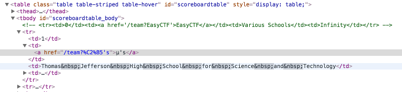
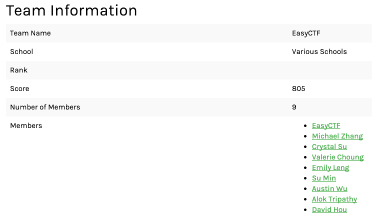
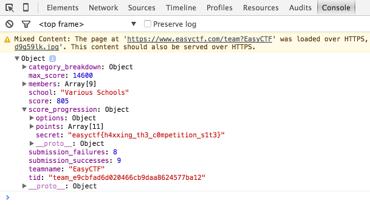

## Challenge

There's a team that's breaking the rules and hiding flags on this site! Find the flag.
Hint: the flag is on this site.

## Solution

Our initial feeling was that there is something hidden on the page of one of the teams based on the challenge text.

We first found a way to get around the cloudflare protection (later fixed) so that we could easily dump all the team data in json format. Scanning for flags only returned a few fake flags in the form of team names, but we did spot an anomaly where we two teams had the same name " ". We thought that maybe the anomaly was because there was an extra non-printable character in the team name not showing up in Firefox. So using Chrome instead, we inspected the element on the page and we see a commented out link at the top of the table.

Now we know that we're getting warmer, and know why our initial team data dump didn't find anything. Visiting the [EasyCTF](https://www.easyctf.com/team?EasyCTF) team page we see the team data but no sign of a flag on the page or the source code.

However, we haven't inspected the json data for this team and a way to view that in Chrome is to open the developer tools, and in the Console tab it will display the parsed json object. Click the arrow to expand it and after some searching we finally find the flag under `score_progression` in the `secret` field!

**easyctf{h4xxing_th3_c0mpetition_s1t3}**

## Notes

Using tools like Burp Suite would get the job done quite easily too.

## Solved by
blanky, r00t, destiny
