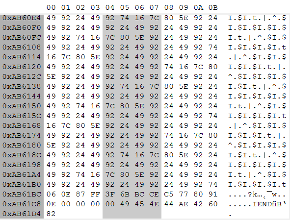
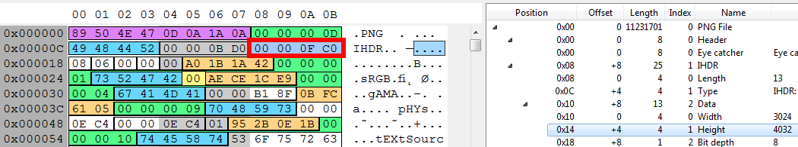
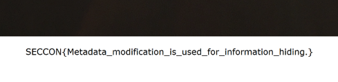

## Challenge

Find the flag in this file.

sunrise.zip

## Solution

I didn't see an English writeup for this one, and I had to find out how to solve it post-CTF since I was close but didn't manage to solve it during the CTF.

We unzip the file to see sunrise.png:


I didn't notice anything out of the ordinary after doing my usual checks. One example that I found elsewhere:

```
$ pngcheck -7fpstvx sunrise.png
Scanning: sunrise.png
sunrise-1.png: contains sunrise.png PNG 1
File: sunrise-1
  chunk IHDR at offset 0x0000c, length 13
    3024 x 4032 image, 32-bit RGB+alpha, non-interlaced
  chunk sRGB at offset 0x00025, length 1
    rendering intent = perceptual
  chunk gAMA at offset 0x00032, length 4: 0.45455
  chunk pHYs at offset 0x00042, length 9: 3780x3780 pixels/meter (96 dpi)
  chunk tEXt at offset 0x00057, length 16, keyword: Source
    iPhone 6s
  chunk tIME at offset 0x00073, length 7: 23 Nov 2015 17:07:55 UTC
  chunk tEXt at offset 0x00086, length 32, keyword: CreationTime
    2015:11:13 06:14:59
  chunk tEXt at offset 0x000b2, length 33, keyword: Creation Time
    2015:11:13 06:14:59
  chunk IDAT at offset 0x000df, length 65243
    zlib: deflated, 32K window, fast compression
...
No errors detected in sunrise-1 (181 chunks, -2254337.3% compression).
```

I don't notice anything odd except for some weird data at the end of the image when viewed in a hex editor.



From another writeup it looks like the editor that they used [Binary Editor BZ](http://www.forest.impress.co.jp/library/software/binaryeditbz/) which shows the extra data in a more visual way. I tried this out for myself and after enabling `View -> Bitmap View` you can see the extra data at the bottom of the image.


Also from another writeup, I have seen that there is also a way to see that there is extra compressed data in the image when trying to manipulate the image in PHP, although I haven't quite yet figured out how to get the same message (please email me if you know!). I will update this in the future if I figure it out.

```
libpng warning: Extra compressed data.
libpng warning: Extra compression data.
gd-png:  fatal libpng error: IDAT: CRC error
gd-png error: setjmp returns error condition 2PHP Warning:  imagecreatefrompng(): 'sunrise.png' is not a valid PNG file ...
Unable to imagecreatefrompng.
```

Ok so we have confirmed that there's extra data at the end of the image, but how to view it?

We simply extend the height of the image via hex editor. But first we need to find the location of the image height to change. There are 3 ways that I'd usually do this, all using a hex editor:

1. Search for the [PNG specification](http://www.libpng.org/pub/png/spec/1.2/PNG-Structure.html) which should detail the file structure. Sometimes I personally find these hard to read, but it may be easy for some of you.
2. Simply convert the image height to hex and search for this in the hex editor. In this case we convert 4032 to hex which comes out as 0FC0.
3. Find a hex editor which includes file "grammar". This makes it super easy to find the data that you need as shown below:



Finally, we increase the size from 4032 to something a bit bigger such as 4245. Converting this to hex gives us 1095 so we replace the existing data with this value.

Viewing the image in GIMP and scrolling to the bottom of the image we finally see the flag.



This challenge only had 18 solves during the CTF, and to be honest I should have been able to get this since I tried something similar on a different challenge recently! But I learnt some new tricks and I'll remember this for next time. Hope you enjoyed reading this.

**SECCON{Metadata_modification_is_used_for_information_hiding.}**

## Notes

I've found other similar editors to BZ such as [HexEdit](http://www.codeproject.com/Articles/135474/HexEdit-Window-Binary-File-Editor)

## Credit

- http://iwasi.hatenablog.jp/entry/2015/12/06/190557
- http://khack40.info/seccon-ctf-2015-steganography-2/
