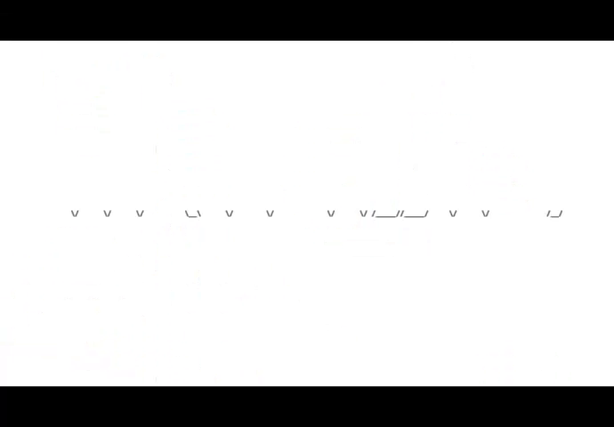
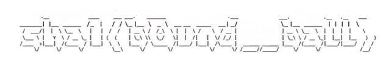

## Challenge

Download the file and we get a video file with balls bouncing around. Video on youtube [here](https://www.youtube.com/watch?v=h-E8FpNbVeA).

## Solution

After analysing the video we noticed that certain frames contain a different image. So to analyse this better we extract all the frames of the video. There are many ways to do this but in this instance we used `ffmpeg`:

```
ffmpeg -i ~/path_to_file/for100.mp4 ./frames/for100-%06d.png
```

Sorting the extracted frames by size made it easy to identify 6 images which contain what look like ASCII art.



Using GIMP we play around with each line until we can make readable ASCII art.



The image says `sha1<b0und__ball>` so create the sha and submit it.

**WhiteHat{ddbae30b37b4e46bf54f91766fa02b42c4c0927d}**

## Solved by
destiny & blanky
