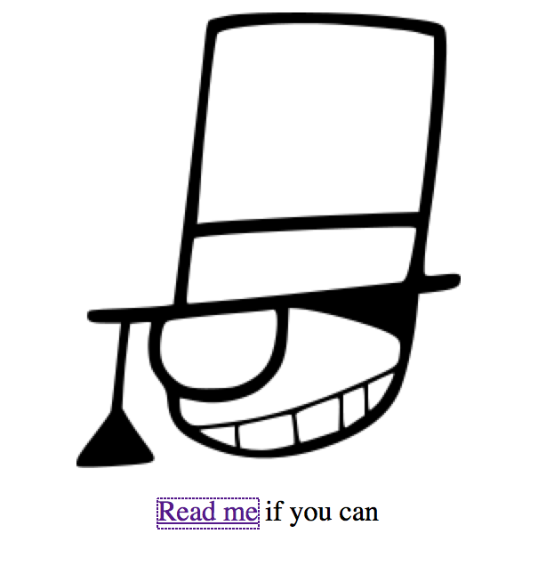
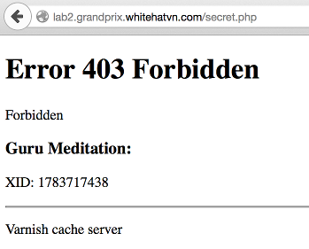
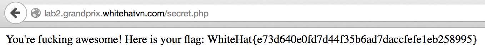

## Challenge

We see a page with a link to the page with the flag at /secret.php but we see get a 403 error when we visit the page:





## Solution

To exploit the filtering we just use the hex value of "secret" in the url:

```
%73%65%63%72%65%74.php
```

Visit `http://lab2.grandprix.whitehatvn.com/%73%65%63%72%65%74.php` to get the flag:



## Solved by
r00t
