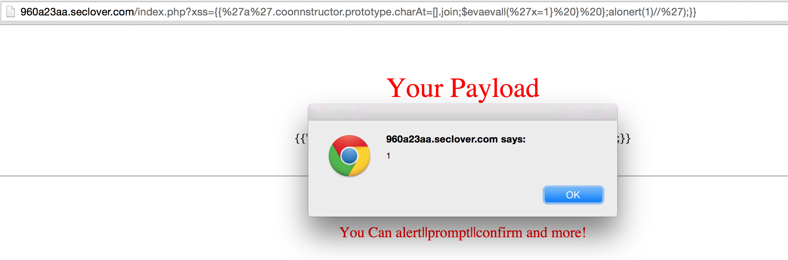

## Challenge

We are given a page with a paramter ?xss=<xss> in which we must find an XSS which can bypass the filters.

## Solution

After some experimenting we find that certain characters such as ["<", ">", ":"] are replaced by "_". These characters could not be escaped by the usual tricks like converting to hex ([examples](http://htmlpurifier.org/live/smoketests/xssAttacks.php))

Other characters were filtered out but it was possible to trick the filters into displaying them by capitalising or repeating the character e.g. `?xss=<s<script>cript>alert(docudocumentment.cookie)</scrip</script>t>` (this example output `_script_alert(document.cookie)_/script_`)

The problem is still that the most critical characters are not escapable. After searching around we find two blog posts ([1](https://sites.google.com/site/bughunteruniversity/nonvuln/angularjs-expression-sandbox-bypass), [2](http://blog.portswigger.net/2016/01/xss-without-html-client-side-template.html)) about angular.js sandbox bypasses which do not require those characters. By modifying the exploit to bypass the second set of filters we are finally able to get an alert on the page.

```
xss?={{'a'.coonnstructor.prototype.charAt=[].join;$evaevall('x=1} } };alonert(1)//');}}
```



We then email proof of the XSS to the organisers to get the flag:

**SSCTF{4c138226180306f21ceb7e7ed1158f08}**

## Solved by
ArtDan
